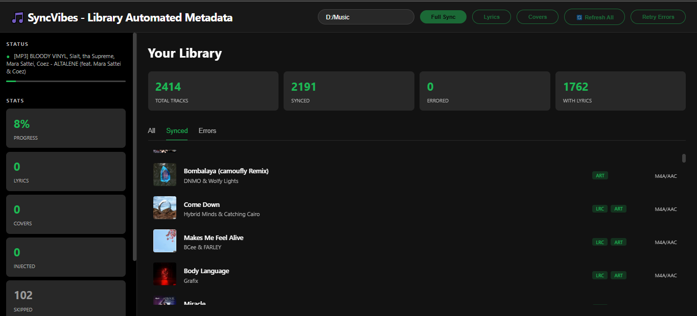
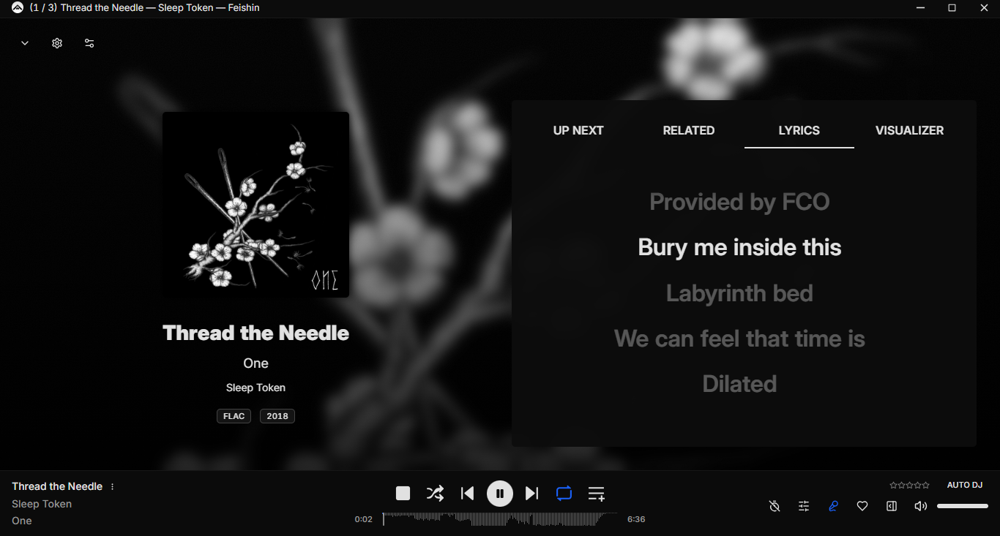
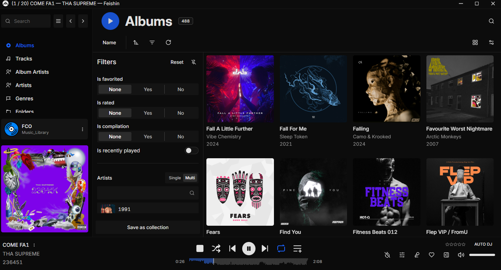

<p align="center">
  
</p>

<p align="center">
  
  
  
  <br>
  
  
  
  
</p>

<h1 align="center">🎵 SyncVibes 🎵</h1>

<p align="center">
  <strong>Automated Metadata + Lyrics Injector for local libraries</strong><br>
  <em>The ultimate bridge between your local library and synchronized music perfection.</em>
</p>

---

A powerful tool designed to inject metadata (synchronized lyrics and high-quality covers) directly into your local audio files. Fully compatible with Navidrome, Jellyfin, and other self-hosted media servers.

## Key Features

- 🎶 **11+ Supported Formats**: MP3, FLAC, M4A, AAC, WAV, OGG, Opus, WMA, APE, WavPack, and Matroska.
- 🔍 **Smart Search**: Utilizes Spotify + LRClib APIs to find accurate, time-synced lyrics.
- 🎨 **High-Quality Covers**: Automatically fetches 600x600px artwork via Spotify API.
- ⚡ **Asynchronous Processing**: Sync 1000+ songs in minutes using async workers.
- 🧠 **Smart Metadata**: Detects existing tags to avoid redundant processing.
- 🔄 **Intelligent Retry**: Target only failed files for re-processing.
- 🎯 **Spotify-like UI**: Clean, responsive sidebar + library view inspired by modern players.
- 💾 **Local Database**: Persistent tracking of all synchronization history (SQLite).

## Screenshots

<p align="center">
  <kbd>
    
  </kbd>
  <br>
  <em>Main Dashboard</em>
</p>
<p align="center">
  <kbd>
    
  </kbd>
  <br>
  <em>Lyrics</em>
</p>
<p align="center">
  <kbd>
    
  </kbd>
  <br>
  <em>Albums</em>
</p>
<p align="center">
  <kbd>
    
  </kbd>
  <br>
  <em>Cover Art</em>
</p>

## Quick Start

### Prerequisites

- Python 3.8+
- Spotify Developer Account (Free)

### 1. Clone the repository

```bash
git clone https://github.com/your-username/syncvibes.git
cd syncvibes
```

### 2. Configure Environment

```bash
cp .env.example .env
```

Edit the `.env` file with your credentials:

```env
SPOTIFY_CLIENT_ID=your_client_id_here
SPOTIFY_CLIENT_SECRET=your_client_secret_here
```

### 3. Install Dependencies

```bash
pip install -r requirements.txt
```

### 4. Run the Application

```bash
python app.py
```

Access: **http://localhost:8895**

## 📋 Configuration (Spotify API)

### Getting your Credentials

1. Go to the [Spotify Developer Dashboard](https://developer.spotify.com/dashboard).
2. Log in or create a free account.
3. Click "Create an App".
4. Copy your `Client ID` and `Client Secret`.
5. Paste these values into your `.env` file.

## Usage

### Web Interface

1. Open http://localhost:8895.
2. Enter the path to your music library.
3. Choose a sync mode:

| Mode             | Action               | Estimated Speed    |
| ---------------- | -------------------- | ------------------ |
| **Full Sync**    | Lyrics + Covers      | ~6 min / 500 songs |
| **Lyrics**       | Lyrics only          | ~3 min / 500 songs |
| **Covers**       | Covers only          | ~4 min / 500 songs |
| **Refresh All**  | Forces a full update | ~6 min / 500 songs |
| **Retry Errors** | Retries failed files | ~1 min / 50 errors |

## Development & Contribution

If you want to help improve the project or add support for new formats, please refer to our [**Development Setup Guide (DEVELOPMENT.md)**](./DEVELOPMENT.md) for detailed instructions.

## Supported Formats

| Format     | Extension  | Metadata Type | Lyrics | Cover |
| ---------- | ---------- | ------------- | ------ | ----- |
| MP3        | .mp3       | ID3v2         | ✅     | ✅    |
| FLAC       | .flac      | Vorbis        | ✅     | ✅    |
| M4A/AAC    | .m4a, .aac | iTunes MP4    | ✅     | ✅    |
| WAV        | .wav       | ID3v2         | ✅     | ✅    |
| OGG Vorbis | .ogg       | Vorbis        | ✅     | ✅    |
| **Opus**   | **.opus**  | Vorbis        | ✅     | ✅    |

_(Full list in the app settings)_

## Smart Metadata Detection

The system automatically detects:

- ✅ If lyrics are already embedded.
- ✅ If high-quality covers already exist.
- ✅ Skips unnecessary duplicates to save bandwidth.
- ✅ Updates only missing tags.

Use **Force Refresh** mode (`force_refresh=true`) to overwrite existing metadata.

## Troubleshooting

### "Path does not exist"

- Ensure the path is correct and accessible.
- Both `/` and `\` are supported.
- Do not use quotes around the path string in the UI.

### "Permission denied"

- Close any application (Spotify, Music Player) that might be locking the files.
- Wait a few seconds and click "Retry Errors".

## Deployment

### Docker (Optional)

Build and run:

```bash
docker build -t syncvibes .
docker run -p 8895:8895 -v $(pwd):/app syncvibes
```

## License

MIT License - see LICENSE for details.

---

**Made with 💚 for music lovers**
